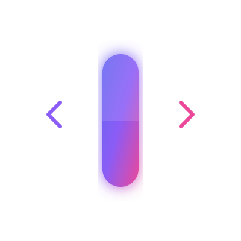

<p align="center">
  
</p>

# Capsule 🚀

**Docker-like packaging, compilation, and testing layer for AI agent workflows.**

[](https://pypi.org/project/capsule-agent/)
[](https://www.python.org/downloads/)
[](https://opensource.org/licenses/MIT)

Capsule is an open-source tool built to solve **framework lock-in** and improve **reproducibility** in AI agent development. Instead of building agent workflows tightly coupled to a single orchestration library, Capsule enables you to **define your workflow once in a framework-neutral spec, test it locally, and compile it to run on any target runtime.**

---

## 💡 Why Capsule?

As AI agent applications grow, developers build complex networks of specialized agents, prompt templates, local tools, and model configs. Today, these are typically built inside frameworks like LangGraph, CrewAI, or OpenAI Agents SDK. 

This leads to several critical issues:
* **Framework Lock-in:** Moving a workflow from LangGraph to CrewAI or OpenAI Agents SDK means throwing away your codebase and rewriting state management, tool bindings, and routing from scratch.
* **Lack of Standalone Testing:** Testing how prompts and agent routes behave across versions without writing custom, complex Python scripts is incredibly difficult.
* **Security & Audits:** If you run an untrusted agent workflow, there is no standardized way to verify what system files, environment variables, or APIs the agent is allowed to access.

**Capsule solves this by serving as a declarative packaging, validation, testing, and compilation layer that sits *above* the execution frameworks.**

---

## 🛠️ Key Features

* **Define Once, Compile Anywhere:** Author your agents, prompts, local Python/MCP tools, and routing steps in a standard `capsule.yaml` file. Compile directly to **LangGraph**, **CrewAI Flows**, or **OpenAI Agents SDK** targets.
* **Runtime Permission Sandboxing:** Intercept tool calls dynamically at runtime. Enforce read, write, or custom scopes. Interactively request approval in terminals, or use pre-approval flags (`--allow-permission` / `--allow-all`) in script pipelines.
* **Declarative Workflow Tests:** Run deterministic, YAML-defined test cases against your workflow with mocked tool responses, checking output values and execution paths.
* **Static Security Scanning:** Instantly audit files, permissions, and tools using `capsule scan` to identify risky imports, shell executions, and permission violations.
* **Lockfiles & OCI-Ready Bundles:** Build hermetic `.capsule` zip archives paired with a `capsule.lock` that pins asset hashes to guarantee reproducibility when sharing workflows.
* **Interactive Documentation & Spec Explorer:** Explore all manifest configurations and guides via a beautiful, local documentation page (`docs/site/index.html`) featuring a reactive Spec Explorer.

---

## 📖 Quickstart Tutorial

### 1. Installation
Install the CLI via `pip` (or use `uv`):
```bash
pip install capsule-agent
# Or check the CLI options using uv
uv run capsule --help
```

### 2. Scaffold a New Project
Initialize a starter Capsule template:
```bash
uv run capsule init customer-support-agent
cd customer-support-agent
```

### 3. Validate & Scan
Verify the project structure and audit security boundaries:
```bash
# Validate manifest paths, schema links, and routing connections
uv run capsule validate

# Scan for security risks, undeclared tool parameters, and dangerous imports
uv run capsule scan
```

### 4. Run the Workflow Locally
Execute the agent workflow using Capsule's local development runtime:
```bash
uv run capsule run --input examples/refund-request.json
```

### 5. Run Workflow Tests
Test routing logic and outputs with mocked tool results:
```bash
uv run capsule test
```

### 6. Compile to Your Favorite Framework
Compile the neutral workflow definition into native target code of your choosing:

**Target 1: LangGraph**
```bash
uv run capsule compile --target langgraph
# Run the compiled project natively:
uv run --with langgraph python dist/langgraph/main.py examples/refund-request.json
```

**Target 2: OpenAI Agents SDK**
```bash
uv run capsule compile --target openai-agents
# Run the compiled project natively:
uv run --with openai-agents python dist/openai-agents/main.py examples/refund-request.json
```

**Target 3: CrewAI Flows**
```bash
uv run capsule compile --target crewai
# Run the compiled project natively:
uv run --with crewai python dist/crewai/main.py examples/refund-request.json
```

### 7. Package and Verify
Create a portable, locked bundle of your workflow for production or sharing:
```bash
# Build the .capsule bundle and generate capsule.lock
uv run capsule build

# Verify a bundle's files against lockfile hashes before execution
uv run capsule verify-bundle dist/customer-support-agent-0.1.0.capsule
```

---

## 📄 Manifest Spec (`capsule.yaml`)

Workflows are declared cleanly in a structured format:

```yaml
name: refund-support-agent
version: 0.1.0
description: Triage customer refund requests and draft responses.

models:
  default:
    provider: openai
    model: gpt-4o-mini

agents:
  triage:
    prompt: agents/triage.md
    model: default
    tools:
      - policy_search

  responder:
    prompt: agents/responder.md
    model: default
    tools:
      - draft_reply

tools:
  policy_search:
    type: python
    entrypoint: tools/policy_search.py:search_policy
    permission: read

  draft_reply:
    type: python
    entrypoint: tools/draft_reply.py:create_draft
    permission: write_draft

workflow:
  start: triage
  steps:
    - id: triage
      type: agent
      agent: triage
      next:
        approved: responder
        needs_human: human_review

    - id: human_review
      type: human_gate
      next: responder

    - id: responder
      type: agent
      agent: responder
      output: final_reply

permissions:
  tools:
    policy_search: read
    draft_reply: write_draft

tests:
  - tests/refund_request.yaml
```

---

## 🗺️ Project Navigation

* `docs/site/`: The Interactive Web Documentation & YAML Spec Explorer.
* `src/capsule/spec/`: Manifest models, YAML loading, and schemas.
* `src/capsule/graph/`: Framework-neutral dependency and workflow graph.
* `src/capsule/validate/`: Integrity rules and path diagnostics.
* `src/capsule/security/`: Permissions checks and static source scans.
* `src/capsule/runtime/`: Local dev runner, runtime permissions checking, schema enforcement.
* `src/capsule/testing/`: Declarative YAML workflow test runner.
* `src/capsule/adapters/`: Compiler targets (**LangGraph**, **OpenAI Agents SDK**, **CrewAI**).
* `src/capsule/bundle/`: Bundler engine, hash-verifier, and lockfile generator.

---

## 🤝 Contributing

We welcome contributions of all kinds! If you'd like to implement new compiler targets (e.g., AutoGen, Haystack, or TypeScript adapters), enrich security rules, or build UI dashboards:
1. Fork the repo and create your branch.
2. Ensure all tests pass: `uv run pytest`.
3. Format with ruff: `uv run ruff format .` and `uv run ruff check .`.
4. Open a Pull Request.

---

## 🔮 Future Roadmap & Vision

Capsule's ultimate goal is to become the **universal packaging, distribution, and runtime verification standard for AI agent workflows**. 

To give creators, developers, and enterprises a unified target, we are actively working towards the following milestones:

* **More Compiler Adapters:** Build compilation engines for **AutoGen**, **Haystack**, **Semantic Kernel**, and native **TypeScript** runtimes so agent workflows can migrate seamlessly between ecosystems.
* **Unified Agent Registry:** A decentralized registry platform (similar to Docker Hub or npm) where teams can publish, version, and download pre-tested, verified `.capsule` agent bundles.
* **Hermetic Security Policies & Sandboxing:** Execute local Python tools inside gRPC sandboxes or WASM containers with strict execution policies (extending the active runtime permissions engine).
* **Visual Graph Inspector & Debugger:** A visual GUI tool to inspect the neutral execution graph, trace active tokens, analyze agent handoffs, and audit decision branches.
* **MCP Integration Engine:** Move from declaration-only MCP tools to real runtime orchestration with automatic MCP server startup, security authorization prompts, and session pooling.

---

## 📈 Star History

If you believe in a framework-neutral, open standard for AI agents, consider starring the repository to support our open-source journey:

[](https://star-history.com/#vindepemarte/Capsule&Date)

---

## 🛡️ License

This project is licensed under the MIT License. See [LICENSE](LICENSE) for details.
